# Rexy Bridge 3.4 — User Guide

A panel-by-panel tour of every control, in the order they appear in the app. Setup and UE connection are covered in **GETTING_STARTED.md**; this guide assumes you're connected and driving a camera.

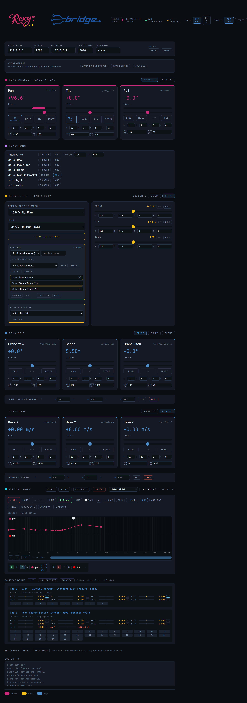

---

## Core concepts (read this first)

**Binding.** Almost every control has a **Bind** button. Click it, then actuate the input you want — a wheel, a stick, a keyboard key, a MIDI knob, or an OSC/FreeD channel. For continuous controls, push it the way you want to be "positive" first; for keys/buttons it captures a two-stage *increase* then *decrease*. Right-click a Bind button to clear it.

**Per-camera bindings.** Every camera you select keeps its **own** set of bindings. Switch cameras and your inputs re-map to that camera's saved layout.

**S / C / D / F tuning.** Wherever you see these four little boxes, they shape how an input drives the value:

- **S — Sensitivity / Speed.** Multiplies how fast the control moves the value. Works for analogue *and* keyboard/button inputs (higher = faster).
- **C — Curve.** Response gamma. `1.0` = linear; higher = "fluid-head" feel (gentle at first, faster as you push); lower = punchy.
- **D — Deadband.** Ignores tiny inputs near centre — kills stick/wheel drift. (Not relevant to keyboard/button inputs.)
- **F — Feather.** Smooths the start and stop so motion eases in and out instead of snapping.

**Inv / Hold / Reset.** **Inv** flips a binding's direction. **Hold** (on wheels) freezes that axis so its binding is ignored. **Reset** returns the control to centre/default.

---

## 1. Top bar


- **Version badge** (`v3.3.0-beta`) — the running build. If it's missing or wrong after an update, press **Ctrl+Shift+R**.
- **HARDWARE** dot — your gamepad/wheels. Wakes when you click the window and press a physical button.
- **WS** dot — the internal app↔bridge link.
- **UE RC** dot — the Unreal Remote Control connection.
- **Units** — global metric (m/cm) vs imperial (ft/in) for distances and positions.
- **Dark / Light** — switches the whole interface between the default dark theme and a pale blue-grey light theme. Your choice is remembered, and every accent colour stays the same in both.
- **Check for updates** — manually checks the release server for a newer build; if one exists it downloads in the background and offers **Restart to update**. Nothing is ever checked automatically on launch.
- **Font** — S / M / L text size for the whole interface; your choice is remembered.

---

## 2. Output mode & network

The **osc / ue** vs **freed** toggle chooses what Rexy Bridge drives, and the network fields beneath it change to match.

- **osc / ue** (default) — drives Unreal directly via Remote Control. The fields show the UE/OSC target host and port.

  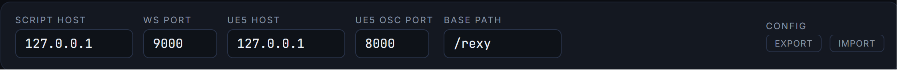

- **freed** — broadcasts a **FreeD** camera-tracking stream on the network so any FreeD-compatible app can consume it (no UE writes). The fields switch to the FreeD stream host/port.

  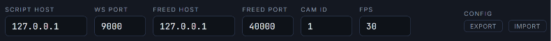

Your connection settings, along with every binding and tuning value, save and reload from the Config controls — export a `.json` to move a whole setup between machines.

---

## 3. Cameras — Scan & select

Before scanning, the camera row is empty and waiting.

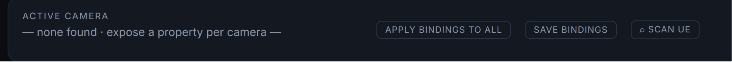

Click **⌕ Scan UE** to auto-discover every Cine Camera Actor and CameraRig_Crane in your open level — no RexyControl preset, no `mappings.json` editing. Actors are matched by **class**, so it finds them whatever you've named them in the Outliner. Review the result, then **Apply** for this session or **Apply + Save** to persist it.

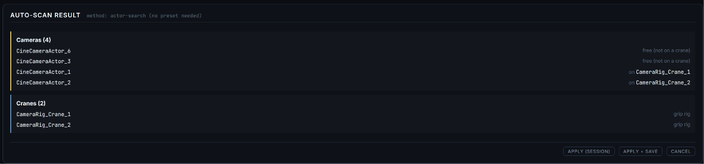

Discovered cameras appear as buttons. Click one to make it the **active** camera; its bindings and profile load.

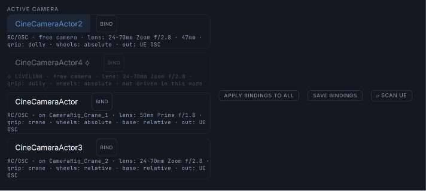

Each camera button can itself be **bound** to a key or gamepad button for hands-free switching mid-shot.

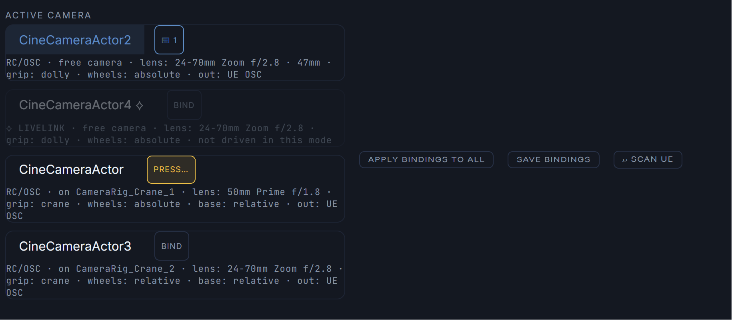

### On UE 5.8 — allow remote function calls

UE 5.8 blocks remote function calls by default, so **Scan UE finds nothing** until you turn this on (one time, per project). In UE: **Project Settings → search "Allow Any Remote Function Call" → tick it on**.

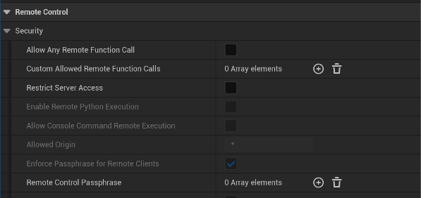

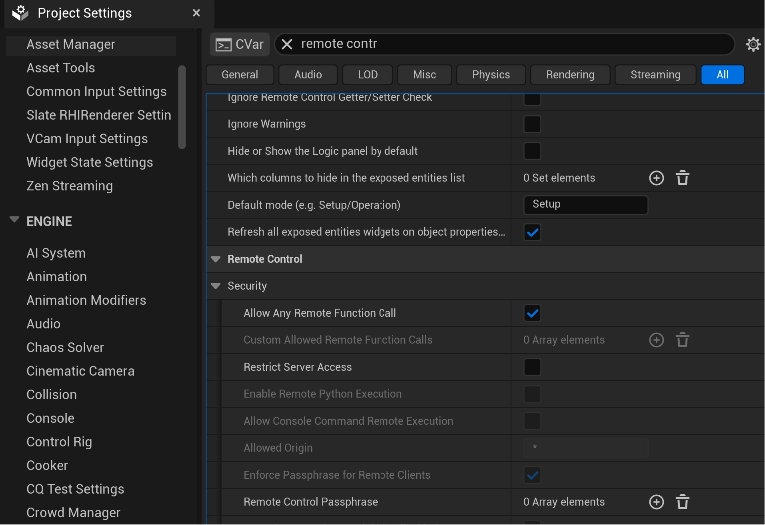

---

## 4. Rexy Wheels — camera head

The three head axes: **pan, tilt, roll**.

- **Absolute** — wheel position = camera angle.

  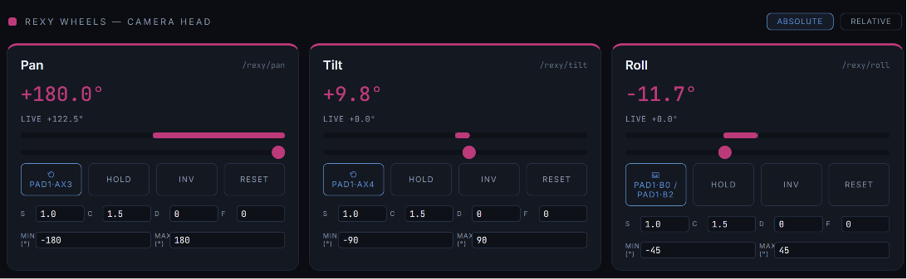

- **Relative** — wheel deflection = rotation *speed*, centre = hold (endless-rotation, fluid-head style).

  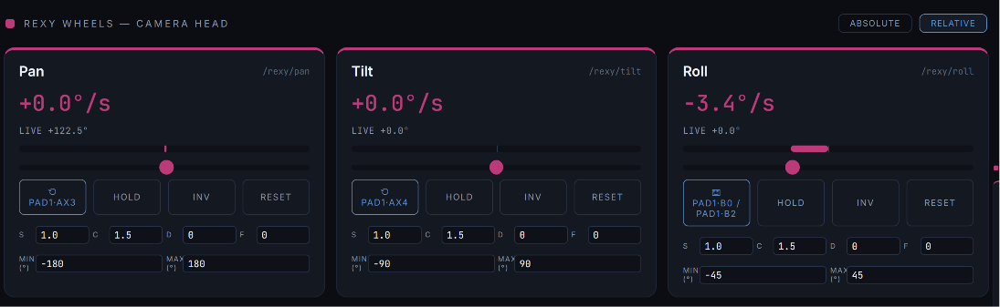

Each card has **Value** and **live —** readouts (commanded vs the camera's actual angle from UE), a **slider**, **Bind / Hold / Inv / Reset**, the **S / C / D / F** tuning row, and **Min / Max** to clamp the output range.

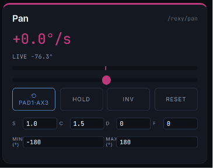

---

## 5. Functions

Bindable one-shot actions. Each card has a **Trigger** (fire it now) and a **Bind** (assign a key/button). Binding any copy of an action keeps every copy in sync.

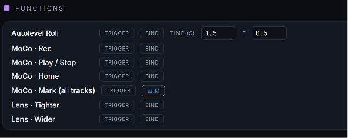

- **Autolevel Roll** — smoothly returns roll to 0° over **Time** seconds, with an **F** easing.
- **MoCo · Rec / Play / Stop / Home / Mark** — transport actions, bindable so you never reach for the mouse mid-take. **Mark** drops a mark on **every bound track** at the playhead.
- **Lens · Tighter / Wider** — step to the next longer/shorter lens in the active **lens box**.

---

## 6. Rexy Focus — lens & body

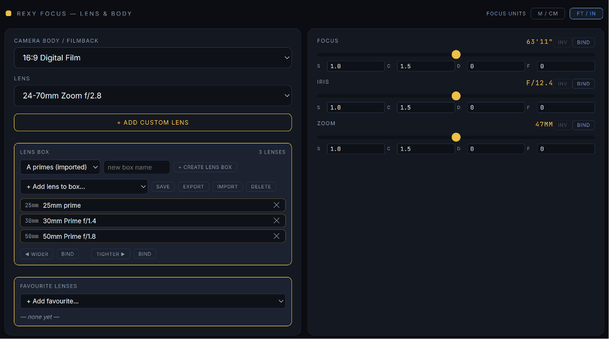

### Lens & body

- **Camera body / filmback** — sensor/filmback preset.
- **Lens** — pick a lens; UE's LensSettings (focal, aperture, min-focus) update live.
- **+ Add custom lens** — define name, focal min/max, f-stop min/max, and **Min focus** (shown in cm or ft to match your Focus-units toggle). It's added to the list and applied.

### Lens boxes

A **lens box** is a named kit — a list of lenses you cycle through on set.

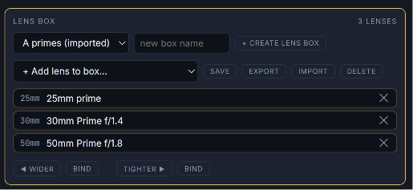

- **Box selector** + **Create lens box** — make and switch between kits.
- **Add lens to box** dropdown — add any existing lens, or **✎ + Custom lens…** to define a new one that drops straight into the box.
- **Lens chips** — the box's lenses, always sorted by focal length; the active lens is highlighted. ✕ removes one.
- **◀ Wider / Tighter ▶** — step through the box by focal length (clamped at the ends). Each has a **Bind** for hardware control.
- **Save / Export / Import / Delete** — boxes export and import independently of the main config, so you can share a kit.

### Favourite lenses

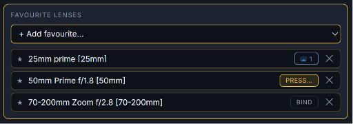

A global quick-jump list. Add any lens, then **Bind** a key/button to jump straight to it — independent of which box is loaded.

### Focus / Iris / Zoom

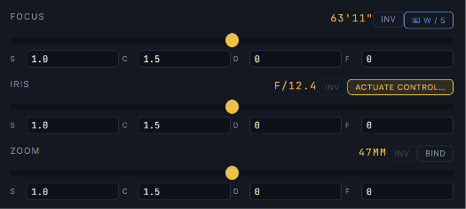

Each has a slider, **Bind**, **Inv**, a live readout, and the full **S / C / D / F** tuning row — so a focus puller can bind a wheel or keys and tune the feel exactly like the head axes. Zoom locks automatically on a prime lens.

---

## 7. Grip — crane / dolly / drone

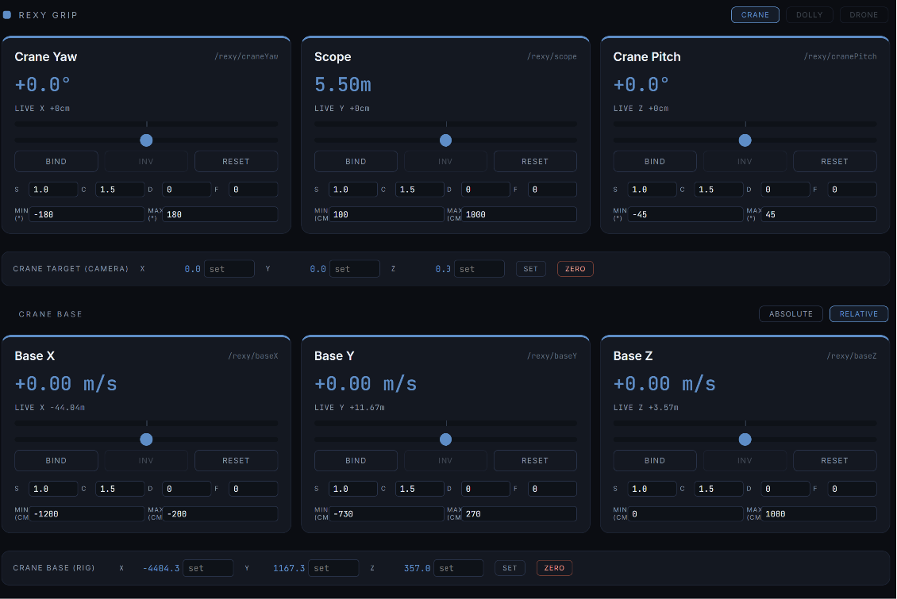

- **Crane** — the grip swings a jib arm around its base (yaw, pitch, scope/arm-length).
- **Dolly** — straight ground translation (X/Y/Z), no arm pivot.
- **Drone** — free flight through 3D space.

In **Drone** mode a **flight-frame** selector appears next to the mode buttons, with three options:

- **Cine** — flies on the world grid; you aim the camera independently with the wheels. Left/right, forward/back and up/down all follow the world axes, exactly like Dolly.
- **Cine/FPV** — left/right and forward/back follow **where the camera is panned**, but stay **parallel to the ground** regardless of tilt or roll; up/down is always a **true vertical** jib. So with the camera tilted 45° down, forward still travels flat in the pan direction, and a rolled camera still tracks level left/right. This is the natural "operator flying a level drone while framing freely" feel.
- **FPV** — everything is relative to the camera body: left/right, forward/back **and** up/down all follow the lens, so up/down rides the roll/tilt. True first-person-drone flight.

**⟳ Reset grid** (next to the frame buttons) re-snaps the Cine/FPV ground grid to the camera's current pan heading. In absolute-pan mode the grid follows the pan wheel live; use Reset if it ever drifts out of sync (e.g. after operating in continuous-wheel mode).

**Hide Crane** (in the Crane Base header, and as a bindable card in the Functions panel) vanishes the crane rig from both the render and the editor viewport, so the arm never appears in shot — press again to bring it back.

The grip cards (craneYaw, scope, cranePitch) use the same binding + S/C/D/F model as the wheels. When **Limits** is unticked, the per-axis Min/Max fields grey out and movement runs unclamped.

### Crane Base

The base (baseX/Y/Z) drives the rig's pivot, with two modes:

- **Absolute** — slider position = base position between Min and Max.

  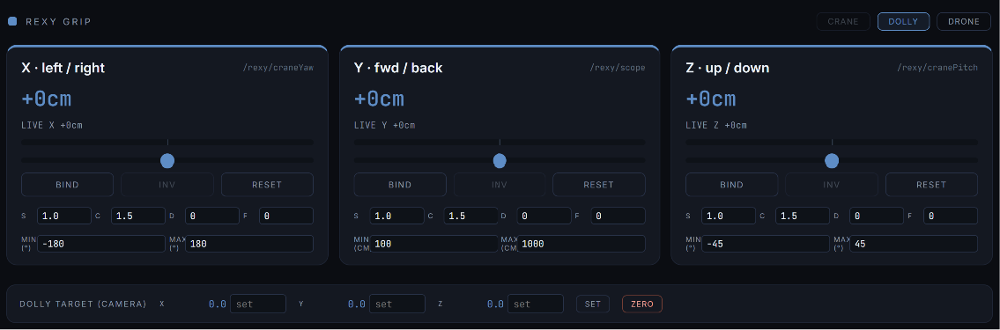

- **Relative** — slider deviation = movement speed (m/s); centre = stop.

  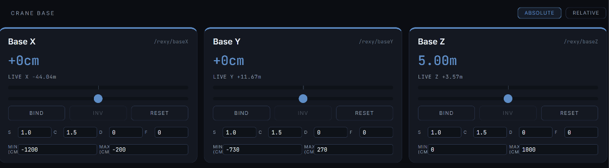

---

## 8. Position panels

Live **X / Y / Z** readouts, with **Set** (send a manual position; blank axes keep their current value) and **Zero** (reset to 0,0,0).

- **Crane target** — where the camera/target sits.

  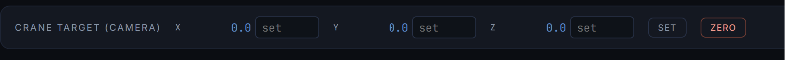

- **Crane base** — where the rig base sits.

  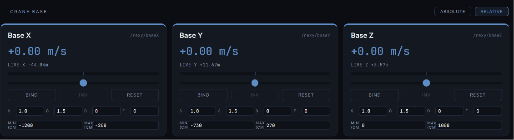

---

## 9. Virtual MoCo

Record, edit, and play back moves across every bound parameter.

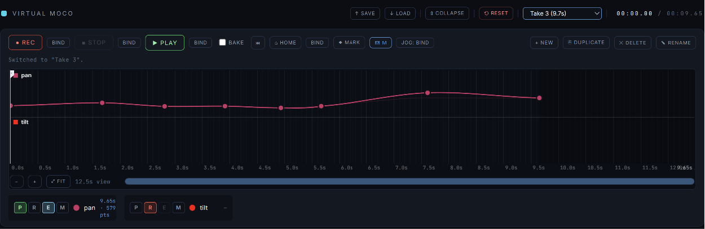

### Transport

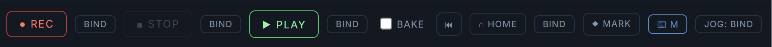

- **● REC / ■ STOP / ▶ PLAY** — each with a **Bind** button. STOP leaves the playhead where it is; **Home** (or Rewind) returns it to the start.
- **Bake** — a 3-2-1 countdown on REC/PLAY so you can sync with UE's Take Recorder.
- **⌂ HOME** — snaps play-armed tracks to their start values and the playhead to 0.
- **◆ MARK** — drops a mark on every bound track at the playhead.
- **Jog: Bind** — bind an analogue wheel/axis (or keys) to **shuttle** the playhead: push from centre to scrub forward/back, speed proportional to deflection, centre = hold.

### Takes

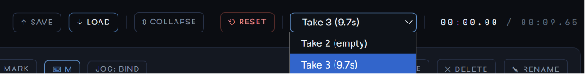

Multi-take management. Save/Load moves as `.rxmove` files. **Expand** stacks each track in its own lane; **Reset** clears everything.

### Timeline & tracks

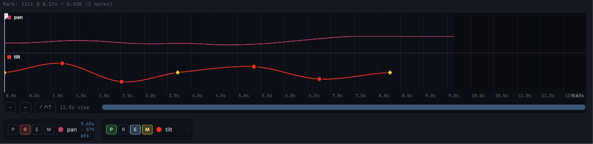

Colour-coded per track. Scrub by dragging the playhead, zoom with the scroll wheel, and drag anchor dots to reshape curves. Each track (left of the timeline) has four arm toggles:

- **P — Play** — plays back its recorded/marked data.
- **R — Record** — captures live input on the next REC (recording over a track auto-erases its marks).
- **E — Edit** — drag anchor dots to reshape. Available once a track has recorded data **or 2+ marks** — entering E on a marked-but-unrecorded track lays down draggable anchors that smooth the marks into **S-curves**.
- **M — Mark** — drops a fixed point at the playhead; the curve always passes through marks. Placing a mark auto-adds a start mark at t=0 so the move has a defined beginning.

---

## 10. Gamepad Debug & calibration

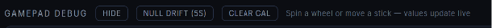

- **Show / Hide** — toggles the live view of every axis and button on connected controllers.
- **Null Drift (5s)** — samples all axes for 5 seconds and stores the average as zero, nulling resting drift. **Clear Cal** removes it.

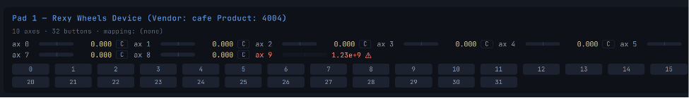

The per-axis **"C"** button opens the calibration wizard. Steps 1–3 capture the axis **max**, **min**, and **rest** so uneven hardware maps to a clean −1…+1. On the live bar the **blue** marker is the captured max and the **pink** marker is the captured min.

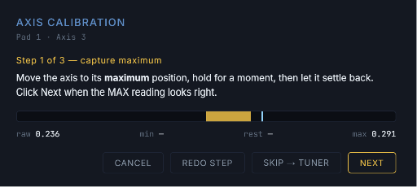

The **Tune response** step shapes the feel, with a live waveform and curve preview. **Skip** jumps straight to the tuner; **Redo step** re-captures the current step.

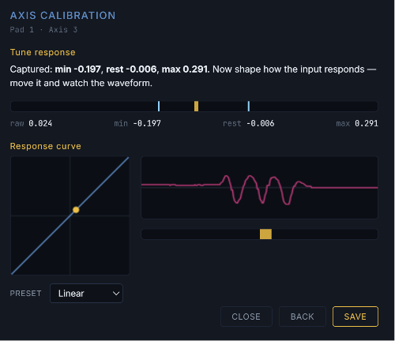

### Tune response

Pick a **preset** — **Linear** (a straight 1:1 response)…

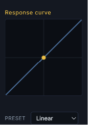

…or **Relaxed** / **Aggressive**, or drag the curve to a custom shape. Gentle-at-centre curves give fine control near rest; steeper ends give quicker throws.

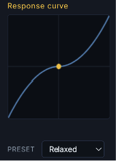

### Signal Filter Lab

Rough or noisy inputs — like a load-cell Grip — can be cleaned up here, live, without touching the device firmware. **Capture** records a few seconds of the axis: the **pink** line is the raw signal, the **cyan** line is the filtered result.

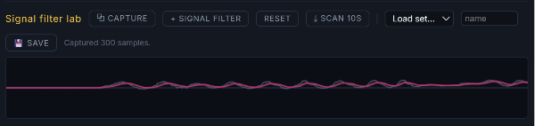

**+ Signal filter** opens a 3×3 grid of the nine filters — Median, Moving average, EMA low-pass, Double-EMA, Kalman, 1-Euro, Hampel, Deadband and Slew limit — each previewing its effect on your captured signal, with editable parameters. **+ Add** appends a filter to the live chain, so several can stack in order and the combined result drives UE in real time.

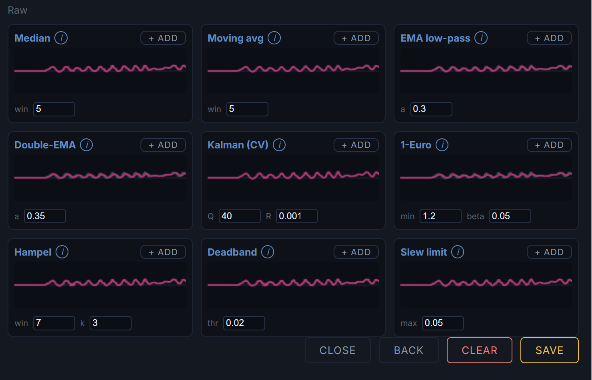

The **ⓘ** icon on each filter explains what it does and what every parameter changes, so you can tune by feel rather than guesswork.

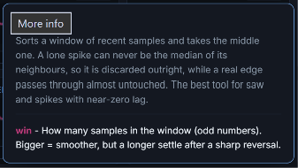

**Save** stores the current chain as a named **filter set** you can **Load** onto any axis or share between machines. **Scan 10s** records raw + filtered + output to a JSON log with a noise-reduction figure, for before/after comparisons.

---

## 11. Other inputs — OSC, MIDI, FreeD

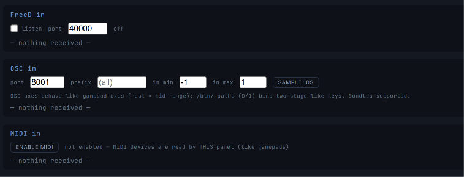

- **OSC in** — accept OSC from external devices (e.g. the Rexy Wheels). Set **port**, an optional **prefix** filter, and the input **min/max** range. **Sample 10s** records every OSC message for ten seconds and exports a JSON log — the ground-truth capture for diagnosing a device.
- **MIDI** — **Enable MIDI** reads MIDI controls (knobs, faders, notes, pitch-bend) into the same input path as gamepads, so they bind the same way.
- **FreeD in** — accept an incoming FreeD tracking stream.

All three feed the same binding system: enable the source, then **Bind** any control to it.

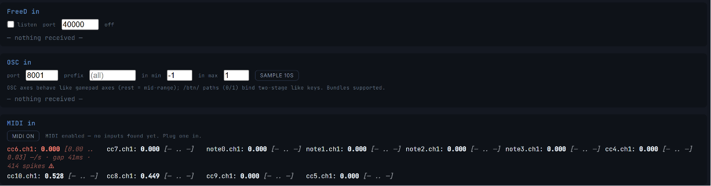

---

## 12. OSC output log

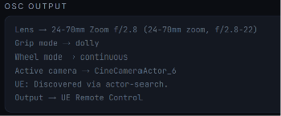

A live feed of what the bridge is sending and status messages — handy for confirming a control is reaching UE and for spotting warnings.

---

## 13. Remote viewing — phone, tablet, or a second laptop

The Rexy Bridge window you see on the PC is not the bridge itself — it's just a web control panel talking to the bridge over the network. That means **any device on the same Wi-Fi/LAN can open the exact same panel in a browser** and drive the same cameras, no install required. Think of it as a wireless director's monitor / second operator station.

**How to open it on another device**

1. On the PC running Rexy Bridge, find its local IP address. Open a Command Prompt and type `ipconfig` — use the **IPv4 Address** (something like `192.168.1.42`).
2. On the phone/tablet/laptop — connected to the **same network** — open a browser and go to:

   `http://192.168.1.42:9000`  *(swap in your PC's IP)*

3. The full control panel loads. It's live and **in sync**: a mode change, a slider, or a binding made on one device shows on all of them, because every panel is a client of the one bridge.

**Good to know**

- The bridge serves on **port 9000** to the whole LAN, so no extra setup is needed — just the IP and that port.
- Physical **wheels / gamepads / MIDI** are read by whichever device they're plugged into. A tablet with no controller is perfect as a **touch surface** (sliders, mode buttons, focus, takes) or a monitoring view, while the PC handles the hardware wheels.
- If the page won't load: both devices must be on the **same network** (not guest Wi-Fi / not a VPN), and a PC firewall prompt for Rexy Bridge must be **allowed** the first time.
- It's the same panel, so everything in this guide applies identically on the remote device.

---

## 14. Rendering your move out of Unreal

**The editor viewport is not what your final render looks like.** The viewport runs in real time at a variable frame rate with little or no motion blur, so camera moves can look steppy or strobe against high-contrast detail — bright lights, foreground objects. A proper render is done offline, one frame at a time, and looks considerably smoother. Judge your move from a render, not the viewport.

### Capturing the move

Rexy Bridge drives the camera live, so first bake that motion into a Level Sequence:

1. **Window → Cinematics → Take Recorder**, add your Cine Camera Actor (and crane) as sources.
2. Press **Record**, perform or play back the move, then stop.

Take Recorder produces a **master sequence** plus a `_Subscenes` folder holding one sequence per recorded actor:

```
Scene_1_17                        <- the master: render THIS
Scene_1_17_Subscenes/
    CineCameraActor2_Scene_1_17
    CameraRig_Crane_Scene_1_17
```

> ⚠️ Render the **master**, not a subscene. A subscene holds one actor's animation with no camera and no Camera Cuts track — the render will report **"no shot"** and render from the wrong viewpoint.

Open the master in Sequencer and confirm it has a **Camera Cuts** track pointing at your Cine Camera Actor (scrubbing should show the camera's view). If it's missing: **+ Track → Camera Cut Track**, then **+ Camera** → your camera, and save.

### Rendering — the setting that matters

**Window → Cinematics → Movie Render Queue → + Render**, pick the master sequence, then click the config link:

| Setting | Suggested | Why |
|---|---|---|
| **Temporal Sample Count** | **8** | **The important one.** Accumulates 8 samples per output frame to produce real motion blur. This is what smooths small steps in camera motion — at 1 you get none. |
| Spatial Sample Count | 1 | Anti-aliasing within a frame; doesn't affect motion. |
| Output Resolution | 1280×720 for tests | Keeps memory use and render time sane. |
| Output Type | JPG Sequence | Small and dependency-free. EXR is huge; MP4/ProRes need an encoder configured. |
| Custom Start/End Frame | ~120 frames | 4 seconds is plenty to judge smoothness. |

Raise resolution and sample count for a final render; keep them low while testing.

If a render crashes, it's almost always memory — MRQ holds every temporal sample of a frame at full resolution at once. Drop the resolution first, then Temporal Samples to 4, and close other applications (including any second Unreal instance).

### If Take Recorder stops with "Timecode rolled over"

Unreal generates timecode from your PC's clock by default. Those wall-clock values become very large frame numbers, which can overflow while a take is being finalised — reported as a rollover.

**Fix:** *Project Settings → Engine → General Settings → Timecode* → untick **Generate Default Timecode**, leave **Timecode Provider** empty, and restart the editor. Unless you're syncing to external gear, you don't need engine timecode at all.

### A note on input smoothness

Motion blur hides a lot, but it can't invent detail that was never sampled. If a move still looks stepped in a render, check the input itself — the **Signal Filter Lab** (section 10) shows the raw device signal, and the tune-scan export records its true resolution and update rate. A low-resolution or slow-reporting control will quantise the move before Rexy Bridge ever sees it, and no amount of filtering fully recovers it.

---

*Questions or bug reports: rob@realprogear.com*
